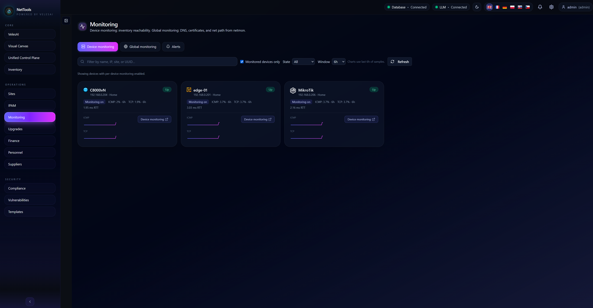
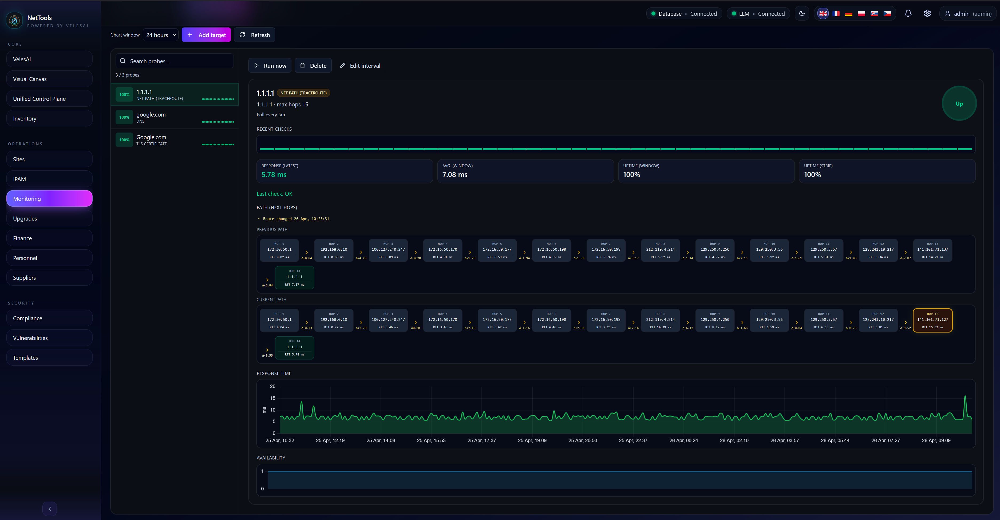
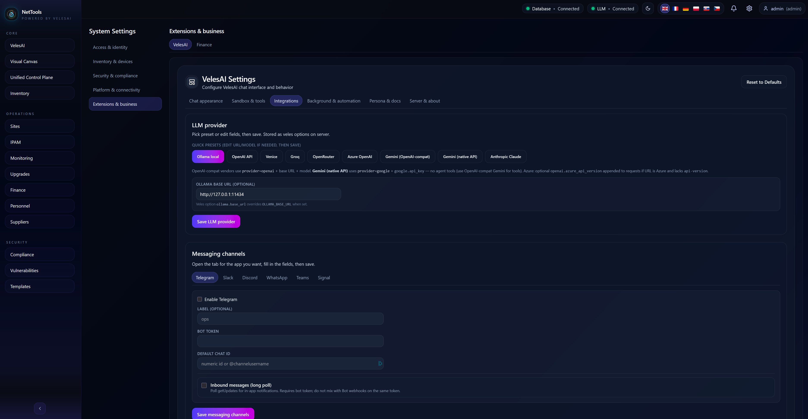

# NetTools-VelesAI

Enterprise-grade, vendor-agnostic network management platform with AI assistance, visual topology, monitoring, backups, and unified control plane operations.

## Contents

- [Overview](#overview)
- [Architecture](#architecture)
- [Core Capabilities](#core-capabilities)
- [Technology Stack](#technology-stack)
- [Security](#security)
- [Observability](#observability)
- [Roadmap](#roadmap)
- [Status](#status)
- [License](#license)

## Overview

NetTools-VelesAI replaces CLI-heavy network operations with visual, AI-assisted workflows.

It combines topology, configuration state, monitoring, backups, vulnerabilities, lifecycle, compliance, and cost data into one operational view. Engineers can inspect devices, validate changes, plan upgrades, track risk, restore configurations, and use VelesAI for contextual guidance while keeping humans in control.

Built for complex multi-site, multi-vendor environments where reliability, clarity, security, and operational cost control matter.

## Architecture

- **Presentation:** React web UI, REST clients, WebSocket clients
- **Application:** FastAPI backend, Vite frontend, WebSocket server
- **Business logic:** Unified Control Plane, policy/config services, upgrade orchestration, backup orchestration, AI tool orchestration
- **Data:** PostgreSQL, pgvector, encrypted credential storage, backup metadata
- **Integrations:** VyOS agents, Cisco SSH, MikroTik API, external APIs, LLM providers, messaging channels, automatic secure tunnels

## Core Capabilities

### Unified Control Plane

- Multi-vendor support: VyOS, Cisco IOS/IOS-XE, Juniper, OPNsense, MikroTik
- Configuration lifecycle: draft -> pending -> applied -> confirmed
- Commit-confirm with automatic rollback
- Firewall, VPN, service policy, and batch command management
- Drift detection, health checks, firmware upgrades, and configuration backups
- MikroTik RouterOS API integration
- Automatic tunnel creation for agents and remote devices

### Visual Network Canvas

- Live topology across sites, vendors, devices, links, zones, and dependencies
- Context-aware actions: inspect, configure, validate, deploy
- Real-time state: health, drift, VPN, lifecycle, vulnerability, and cost context
- Change impact visible before commands execute

### VelesAI Assistant

- RAG over device configurations and operational data
- Context-aware chat with persistent memory
- Tool-based reasoning for inventory, config, analysis, and knowledge
- Web search, vulnerability context, streaming responses, and file-assisted analysis
- Inline AI support for upgrades, maintenance, validation, and risk review

### Vulnerabilities & Compliance

- CVE ingestion and device correlation
- Impact mapping by device, firmware, site, and lifecycle state
- End-of-life and support tracking
- Upgrade recommendations aligned with vendor guidance
- Compliance views mapped to frameworks such as NIST CSF, ISO 27001, and CIS Controls

### Financial & Lifecycle Controls

- Device CapEx, OpEx, license, and support tracking
- Firmware lifecycle awareness
- CSV import/export for finance, inventory, and audits
- Aggregated cost and risk views by site or region

### Device & Site Management

- Multi-vendor inventory and site organization
- Firmware planning, staged upgrades, and post-upgrade checks
- Automated configuration backups, retention policies, exports, and pre-change snapshots
- Backup history for restore, audit, and change comparison workflows
- SSH/API collection with vendor parsers
- MikroTik RouterOS API support
- Inline AI guidance for auditable maintenance workflows

### Monitoring

- Device reachability, interface, VPN, service, agent, and tunnel health
- Alerts for drift, failed checks, lifecycle risk, and connectivity loss
- Historical health views by site, device, and critical path
- Prometheus-compatible metrics and operational dashboards

### LLM Inference Providers

- Ollama for local/private inference
- OpenAI-compatible APIs for hosted or self-managed gateways
- Azure OpenAI for enterprise cloud deployments
- Anthropic Claude for advanced reasoning workflows
- vLLM and llama.cpp-compatible local model servers
- Provider selection by task, policy, latency, and data sensitivity

### Messaging Channels

- Slack, Microsoft Teams, email, and webhook delivery
- Routing by device health, tunnel state, compliance, vulnerability, lifecycle, or upgrade event
- Human approval flows for high-risk actions
- AI-generated summaries for incidents, maintenance windows, and upgrade plans
- Audit-friendly links back to devices, sites, changes, and alerts

## Technology Stack

- **Backend:** FastAPI, SQLModel/SQLAlchemy, PostgreSQL, pgvector, WebSockets, Paramiko/Netmiko, MikroTik API
- **AI:** Ollama, OpenAI-compatible APIs, Azure OpenAI, Anthropic, vLLM, llama.cpp-compatible endpoints
- **Frontend:** React 19, Vite, Tailwind CSS, Radix UI, React Router, XTerm.js, Chart.js
- **Infrastructure:** Docker, Docker Compose, Nginx, GitHub Actions, Prometheus, Sentry
- **Messaging:** Slack, Microsoft Teams, email, webhooks

## Security

- AES-256 encrypted credential storage
- RBAC
- SSH keys and certificate-based device authentication
- Mutual TLS for agent communication
- Audit and communication logging
- Secure defaults across platform services

## Observability

- Structured JSON logs
- Correlation IDs
- Prometheus metrics
- Health checks for database, agents, tunnels, devices, and external services
- Real-time device and VPN status monitoring

## Roadmap

- Multi-region support
- Predictive analytics
- AI-assisted remediation
- External REST API
- OAuth2, SAML, and MFA

## Status

Actively developed MVP+ with working UI, backend, and AI integration. Designed for pilot deployments with enterprise and industrial partners.

## License

License will be defined before first public release or pilot agreement.
